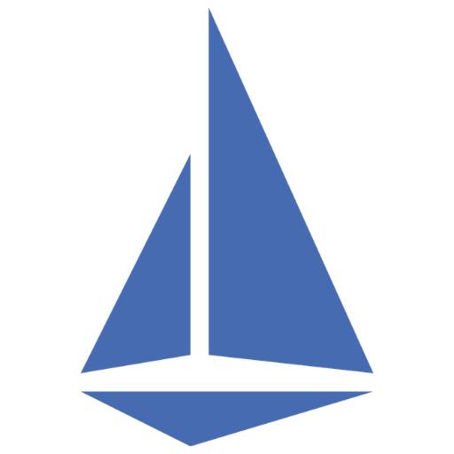
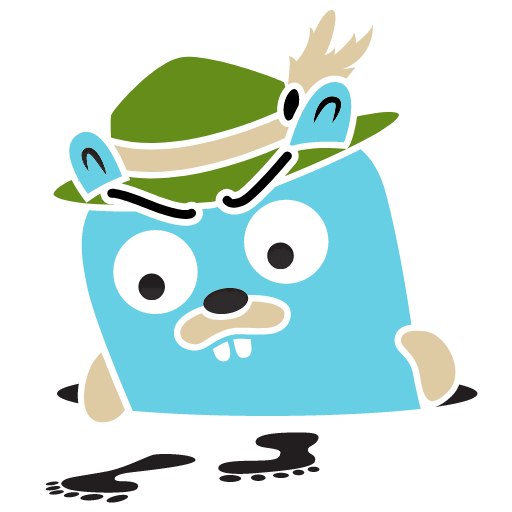
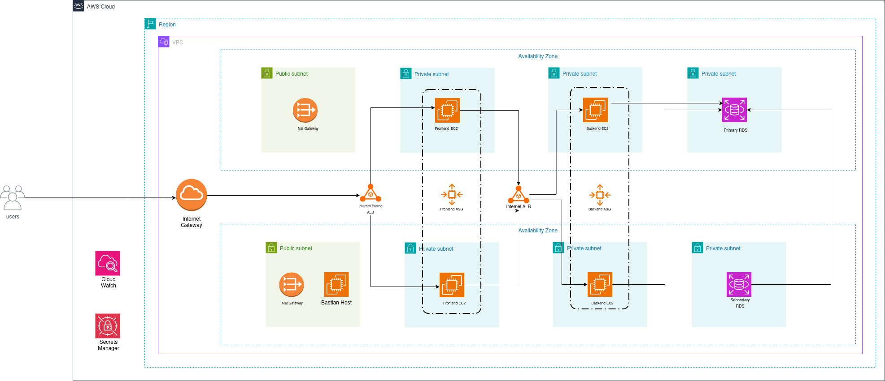
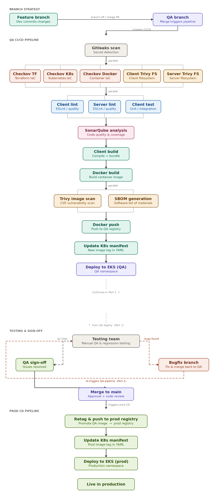

<!--
Credits and references used in this README:

1) Skill icons:
   https://github.com/tandpfun/skill-icons

2) Certification badges:
   AWS and CKA public badges from Credly
-->

# Hi, I'm Awais Mansha 👋

**`DevOps Engineer | AWS Certified Solutions Architect – Associate | Certified Kubernetes Administrator`**

## About Me

- DevOps Engineer with a cybersecurity background, focused on cloud infrastructure, automation, Kubernetes, CI/CD, Observability and secure software delivery.
- Hands-on with AWS, Terraform, Docker, Kubernetes, Istio, GitHub Actions, ArgoCD, and production-style deployment workflows.
- Experienced in DevSecOps practices including secret scanning, IaC scanning, container image scanning, SBOM generation, and code quality checks.
- Work with Prometheus, Grafana, EFK Stack, Jaeger, and OpenTelemetry for metrics, logs, traces, and cloud-native observability.
- AWS Certified Solutions Architect – Associate and Certified Kubernetes Administrator.

---

## Skill Stack

&nbsp;

&nbsp;

&nbsp;

---

## Projects - Showcase

<table>
  <tr>
    <td align="center" width="33%">
      
       
      <b>AWS Terraform 3-Tier Architecture</b> 
      Designed and provisioned a highly available 3-tier AWS architecture using Terraform, including VPC, public/private subnets, NAT Gateway, Bastion Host, EC2 instances, load balancing, and RDS. 
      🔗 <a href="https://github.com/awaismansha-00/aws_terraform_3tier">Repo</a>
       
      Tags: AWS, Terraform, VPC, EC2, RDS, Load Balancing, Security
    </td>
    <td align="center" width="33%">
      
       
      <b>Production-Grade DevSecOps Project</b> 
      Implemented a production-style DevSecOps workflow with branch strategy, CI/CD, security scanning, code quality checks, container image scanning, SBOM generation, Kubernetes deployment, and promotion to production. 
      🔗 <a href="https://github.com/awaismansha-00/production-grade-devsecops">Repo</a>
       
      Tags: DevOps, DevSecOps, GitHub Actions, ArgoCD, Kubernetes, Trivy, SonarQube
    </td>
    <td align="center" width="33%">
      
       
      <b>OpenTelemetry Demo DevOpsification</b> 
      Containerized selected microservices, deployed them on Kubernetes, provisioned cloud infrastructure with Terraform, and implemented observability using Prometheus, Grafana, EFK Stack, Jaeger, and OpenTelemetry. 
      🔗 <a href="https://github.com/awaismansha-00/opentelemetry-demo-devops">Repo</a>
       
      Tags: OpenTelemetry, Prometheus, Grafana, EFK, Jaeger, Docker, Kubernetes, Terraform
    </td>
  </tr>
</table>

---

## Certifications

&nbsp;&nbsp;

---

## Links

&nbsp;

&nbsp;

